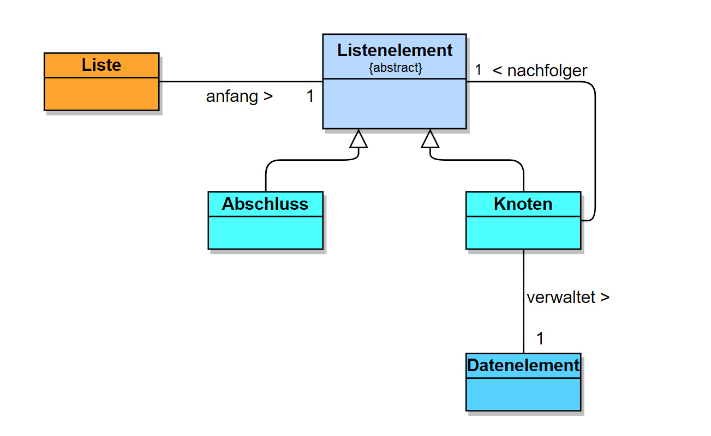

# Liste
Eine einfach verkettete Liste, implementiert mit dem Entwurfsmuster Kompositum

## Grundstruktur

### Entwurfsmuster Kompositum
Das Entwurfsmuster Kompositum wird hier eingesetzt, um die komplexeren Knotenobjekte und die einfacheren Abshlussobjekte einheitlich zu behandeln,
sodass der Nachfolger eines jeden Knotens sowohl ein weiterer Knoten, als auch ein Abschluss sein kann, ohne dass der Knoten diesen unterscheiden, 
überprüfen oder anders behandeln muss.

### Klassendiagramm

## Methoden

### Rekursive Methodenaufrufe
Die Grundidee hinter den meisten Methoden ist die Vereinfachung einer Aufgabe mit jeder Weitergabe an den Nachfolger, sodass das Abschlussobjekt
diese direkt lösen kann. Danach können auch die vorherigen Situationen rückwärts durchlaufen und bearbeitet werden.  
Für das Weitergeben des Befehls werden dem Nachfolger Parameter gegeben, für das Weitergeben von Informationen/Objekten beim Rücklauf wird der 
Rückgabewert der Funktionen genutzt.
